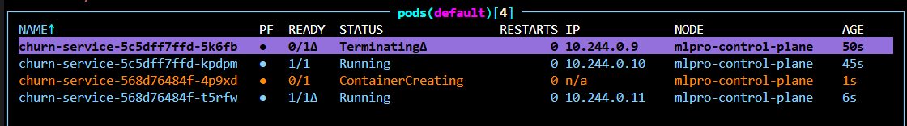
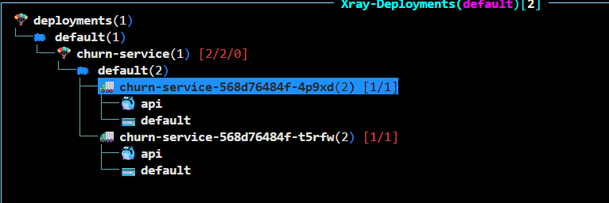
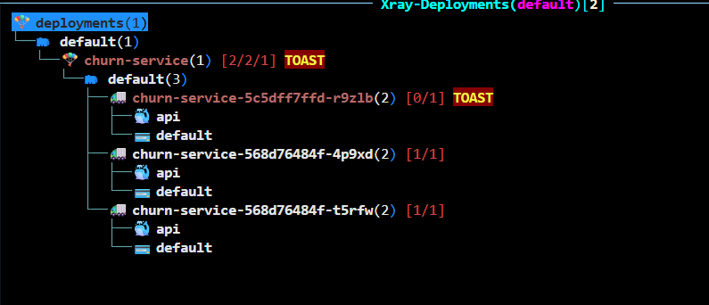

# Отчёт: churn-service от артефакта до кластера

Домашнее задание 1, ML PRO. Сервис предсказания оттока клиентов банка:
модель → FastAPI → тесты → Docker → Compose с Postgres → Kubernetes в kind.

## Чекпоинты

### 1. Тесты

```bash
uv run pytest
```

9 тестов: контракт (лишнее поле, пропущенное поле, неверный тип, неизвестная категория,
значение вне границ — все дают 422), smoke (код 200, скор в диапазоне [0, 1],
типы полей ответа), детерминизм (один вход дважды даёт один скор).


### 2. Логи предсказаний в Postgres

```bash
docker compose up -d --build
curl -X POST http://localhost:8000/v1/predict -H "Content-Type: application/json" -d "@valid.json"
docker compose exec -T db psql -U postgres -d churn -c "SELECT request_id, score, latency_ms, status_code, ts FROM predictions;"
```

`request_id` в строке таблицы совпадает с тем, что вернул сервис, `status_code` = 200.


### 3. Поды в кластере

```bash
kubectl get pods
```

Две реплики сервиса.


### 4. Предсказание через port-forward

```bash
kubectl port-forward svc/churn-service 8080:80
curl -X POST http://localhost:8080/v1/predict -H "Content-Type: application/json" -d "@valid.json"
```

Три порта на пути запроса: 8080 на машине, 80 у Service, 8000 в контейнере.


### 5. k9s


## Нагрузочное тестирование (Locust)

Сценарий — `locustfile.py`: около 83% запросов POST `/v1/predict` и 17% GET `/health` (веса 5 : 1),
пауза 0.5–2 с. Нагрузка на compose-версию (один uvicorn-процесс), три прогона по 60 с.
CSV-отчёты Locust сохраняются в `loadtest/` и в репозиторий не коммитятся.

| users | RPS | median, ms | p95, ms | max, ms | ошибки |
|---|---|---|---|---|---|
| 10 | 7.8 | 9 | 18 | 43 | 0 / 463 |
| 50 | 38.7 | 11 | 36 | 118 | 0 / 2295 |
| 100 | 75.7 | 22 | 100 | 275 | 0 / 4494 |

```bash
uv run locust -f locustfile.py --headless -u 10  -r 5  -t 60s --csv loadtest/run10  -H http://127.0.0.1:8000
uv run locust -f locustfile.py --headless -u 50  -r 10 -t 60s --csv loadtest/run50  -H http://127.0.0.1:8000
uv run locust -f locustfile.py --headless -u 100 -r 20 -t 60s --csv loadtest/run100 -H http://127.0.0.1:8000
```

**Выводы.** RPS растёт почти пропорционально числу пользователей (7.8 → 38.7 → 75.7): при средней паузе
1.25 с это близко к теоретическим 8, 40 и 80 RPS, то есть до предела сервис не дошёл ни в одном прогоне.
На 10 и 50 пользователях очереди почти нет: медиана 9–11 мс ≈ времени одного predict.
На 100 пользователях p95 оторвался от медианы — 100 мс против 22, в 4.5 раза, — запросы начинают вставать
в очередь к единственному процессу uvicorn. Ошибок не было ни в одном прогоне. Чтобы найти потолок RPS,
нужен прогон с большим числом пользователей; чтобы его поднять — больше воркеров uvicorn или реплик.

## Батч-эндпоинт

Ручка `POST /v1/predict/batch`, схема `{"rows": [Features, ...]}`, от 1 до 1000 строк. Все строки собираются
в один DataFrame, `pipeline.predict_proba` вызывается один раз, ответ — списки `scores` и `churn` в порядке `rows`.
Пустой список или больше 1000 строк дают статус 422. Батч в Postgres не логируется: таблица `predictions`
рассчитана на одну строку на запрос.

Замер `latency_ms` из ответа сервиса (compose), медиана из 10 повторов после прогревочного запроса:

| строк | median, ms |
|---|---|
| 1 | 4.7 |
| 100 | 5.5 |
| 500 | 7.4 |
| 1000 | 9.1 |

**Вывод.** 500 строк дороже одной всего в 1.6 раза (7.4 против 4.7 мс): около 0.015 мс на строку против 4.7 мс
на одиночный запрос. Почти всё время уходит на фиксированные накладные расходы — построение DataFrame, `reindex`,
проход по шагам Pipeline, вызовы pandas и sklearn.
## Выкат новой версии и откат

Образ `churn-service:1.1` отличается от 1.0 батч-эндпоинтом `/v1/predict/batch`.

```bash
docker build -t churn-service:1.1 .
kind load docker-image churn-service:1.1 --name mlpro
kubectl set image deploy/churn-service api=churn-service:1.1
kubectl rollout status deploy/churn-service
kubectl rollout undo deploy/churn-service
kubectl rollout history deploy/churn-service
```

Выкат 1.0 → 1.1: старые и новые поды работают одновременно.



После выката — два пода 1.1:



Откат 1.1 → 1.0: новый под 1.0 ещё не готов, оба пода 1.1 продолжают отвечать.




Ревизия 4 — образ 1.1, ревизия 5 — 1.0, вернувшаяся откатом. Откат не восстанавливает старый номер
ревизии, а создаёт новую с шаблоном предыдущей, поэтому ревизия 3 из истории пропала.

**Вывод.** Во время выката поды менялись по одному сначала поднимался под с новым образом, и только после
того как он проходил readiness-пробу `/ready`, Kubernetes завершал один старый. Откат вернул образ 1.0
без батч-эндпоинта — `/v1/predict/batch` исчез из `/docs`. Сервис не молчал, потому что стратегия
`RollingUpdate` держит работающие поды до готовности новых, а Service направляет трафик только на поды
в состоянии Ready.

## Журнал проблем

(что не завелось с первого раза: текст ошибки → как починили)

### Сервис

1. Поля схемы `Features` были голыми `int` и `str`: запрос с `tenure: -1` или `geography: "Атлантида"` → статус 200 и правдоподобный скор. Неизвестную категорию `OneHotEncoder(handle_unknown="ignore")` молча превращал в нулевой вектор. → Границы через `Field(ge/le)`, допустимые категории через `Literal[...]`, на каждый случай добавлен тест с ожиданием 422.
2. Опечатка `geografy` в схеме при `geography` в паспорте модели: сервис не падал, `reindex(columns=meta["features"])` ставил `NaN`, `SimpleImputer(strategy="most_frequent")` подставлял самую частую страну — все клиенты становились французами. → Исправлено имя поля. Правило: имена в схеме запроса обязаны совпадать со списком `features` из паспорта, расхождение проявляется молча.

Общая проблема — опечатки: в именах полей схемы, в ключевых словах DDL, в именах колонок таблицы.
Самые неприятные из них не роняли сервис: он отвечал 200, а ошибка всплывала только в данных или в логах.

