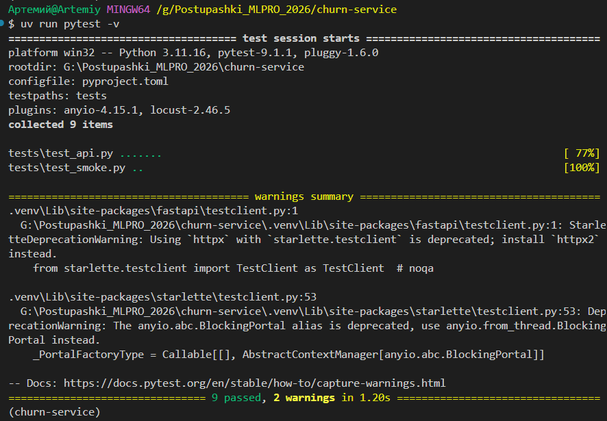
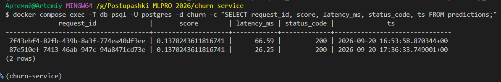
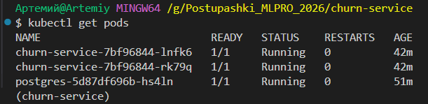
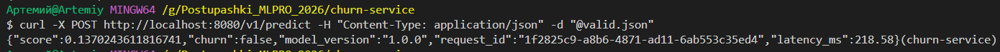
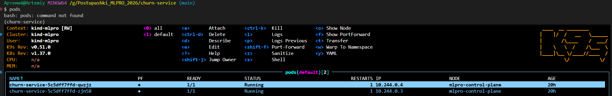

# Отчёт: churn-service от артефакта до кластера

Домашнее задание 1, ML PRO. Сервис предсказания оттока клиентов банка:
модель → FastAPI → тесты → Docker → Compose с Postgres → Kubernetes в kind.

## Чекпоинты

### 1. Тесты

```bash
uv run pytest
```

9 тестов: контракт (лишнее поле, пропущенное поле, неверный тип, неизвестная категория,
значение вне границ — все дают 422), smoke (код 200, скор в диапазоне [0, 1],
типы полей ответа), детерминизм (один вход дважды даёт один скор).



### 2. Логи предсказаний в Postgres

```bash
docker compose up -d --build
curl -X POST http://localhost:8000/v1/predict -H "Content-Type: application/json" -d "@valid.json"
docker compose exec -T db psql -U postgres -d churn -c "SELECT request_id, score, latency_ms, status_code, ts FROM predictions;"
```

`request_id` в строке таблицы совпадает с тем, что вернул сервис, `status_code` = 200.



### 3. Поды в кластере

```bash
kubectl get pods
```

Две реплики сервиса и Postgres.



### 4. Предсказание через port-forward

```bash
kubectl port-forward svc/churn-service 8080:80
curl -X POST http://localhost:8080/v1/predict -H "Content-Type: application/json" -d "@valid.json"
```

Три порта на пути запроса: 8080 на машине, 80 у Service, 8000 в контейнере.



### 5. k9s



## Журнал проблем

### 1. Сервис принимал мусор на вход

Схема `Features` описывала поля как голые `int` и `str`. Запрос с `tenure: -1`
или `geography: "Атлантида"` проходил валидацию, возвращал 200 и правдоподобный скор.

Опаснее всего был случай с неизвестной категорией: `OneHotEncoder(handle_unknown="ignore")`
превращает её в нулевой вектор, модель считает по нему и ошибку невозможно заметить
по ответу сервиса.

**Починка:** границы через `Field(ge=..., le=...)` и допустимые категории через
`Literal[...]`. Добавлены тесты на каждый случай.

### 2. Опечатка `geografy` в схеме

Поле называлось `geografy`, а в паспорте модели — `geography`. Сервис не падал:
`reindex(columns=meta["features"])` не находил колонку, ставил `NaN`,
`SimpleImputer(strategy="most_frequent")` подставлял самую частую страну.
Все клиенты для модели становились французами.

**Починка:** исправлено имя поля. Вывод на будущее: имена в схеме запроса обязаны
совпадать со списком `features` из паспорта, расхождение проявляется молча.

### 3. Опечатки в DDL

При первом подключении базы `db.init()` падал на `CREATE TABLE`.

```
syntax error at or near "predictions"
```

В тексте DDL было три ошибки: `IF NOT EXIST` вместо `IF NOT EXISTS`,
`timestampz` вместо `timestamptz`, `double presicion` вместо `double precision`.
Ошибка не проявлялась, пока `DATABASE_URL` не был задан: обе функции `db.py`
в этом случае сразу выходят.

**Починка:** исправлены ключевые слова. Позже туда же добавилась пропущенная запятая
между `latency_ms real` и `status_code int`.

### 4. Колонка `latency` против `latency_ms`

В DDL колонка называлась `latency`, а `INSERT` писал в `latency_ms`.
Каждый запрос ронял фоновую задачу с `column "latency_ms" does not exist`,
при этом клиент получал нормальный ответ 200 — ошибка была видна только в логах.

**Починка:** имена приведены к одному. Отдельная сложность: `CREATE TABLE IF NOT EXISTS`
не меняет существующую таблицу, поэтому её пришлось удалить и создать заново.

### 5. Порт 8000 занят

```
Error response from daemon: failed to set up container networking:
Bind for 0.0.0.0:8000 failed: port is already allocated
```

`docker compose up` не смог занять порт хоста: на нём висел локально запущенный uvicorn.

**Диагностика:** `netstat -ano | findstr :8000` показал PID, `tasklist` — что это `python.exe`.

**Починка:** остановлен локальный процесс. Альтернатива — сменить порт хоста в `compose.yaml`
на `8001:8000`, порт внутри контейнера при этом не меняется.

### 6. Поды в `CreateContainerConfigError`

После `kubectl apply -f k8s/` поды 19 минут висели в `CreateContainerConfigError`
с нулём перезапусков — контейнер ни разу не стартовал.

**Диагностика:** `kubectl describe pod <имя>`, раздел `Events`:

```
Error: configmap "churn-config" not found
Error: secret "churn-secrets" not found
```

`deployment.yaml` ссылается на ConfigMap и Secret через `envFrom`. Это жёсткая ссылка:
если объекта нет, kubelet не собирает конфигурацию контейнера и ждёт, ничего не перезапуская.
`kubectl get configmap,secret` подтвердил, что в кластере их нет.

**Починка:** создан `k8s/configmap.yaml`; секрет создан командой
`kubectl create secret generic churn-secrets --from-literal=...` и в репозиторий не коммитится.
Поды поднялись сами, без пересоздания.

В итоговой версии ConfigMap и Secret из манифестов убраны вместе с `envFrom`: в кластере
сервису хватает значений по умолчанию, а логирование в Postgres проверяется в Compose.
Меньше движущихся частей — меньше способов сломаться у проверяющего.

Попутный вывод: `Service` при этом существовал и имел IP, но `kubectl get endpoints churn-service`
показывал `<none>` — трафик идёт только на поды в состоянии Ready. При отладке сервиса
endpoints стоит смотреть первым делом.

### 7. Контейнер работал на старом коде

В `db.py` добавлено поле `status_code`, сделан `docker compose restart api`,
таблица пересоздана — но `\d predictions` показывал прежние шесть колонок.

**Диагностика:** локальный `print(db.DDL)` показывал новый DDL с `status_code`,
а таблица создавалась по старому. Значит, контейнер выполнял не тот код, что лежит на диске.

**Причина:** код попадает в образ на этапе сборки (`COPY src/ src/`). `restart`
перезапускает контейнер из существующего образа и правок на диске не видит.

**Починка:** `docker compose up -d --build`. В Kubernetes тот же эффект требует трёх шагов:
`docker build`, `kind load docker-image`, `kubectl rollout restart` — без `kind load`
нода оставляет у себя прежний образ с тем же тегом.

### 8. Перезапуски подов после старта

Поды сервиса показывали `RESTARTS 2`, хотя в итоге переходили в `Running`.

**Причина:** в Kubernetes нет аналога `depends_on: condition: service_healthy` из Compose.
Поды api стартуют одновременно с Postgres, `db.init()` в `lifespan` не успевает подключиться,
приложение падает, Kubernetes перезапускает контейнер. К третьей попытке база готова.

**Статус:** не чинилось — поведение штатное, сервис приходит в рабочее состояние сам.
Аккуратнее было бы добавить в `lifespan` повторные попытки подключения.

## Что осталось за рамками

- Пул соединений: `save_prediction` открывает новое подключение на каждый запрос,
  под нагрузкой это станет узким местом. Решение — `psycopg_pool.ConnectionPool` в `lifespan`.
- Логируются только успешные запросы: 422 отсекается Pydantic до входа в обработчик,
  поэтому в таблицу попадает только `status_code = 200`. Для полной картины нужен middleware.
- `PersistentVolumeClaim` для Postgres в кластере: сейчас данные живут, пока живёт под.
