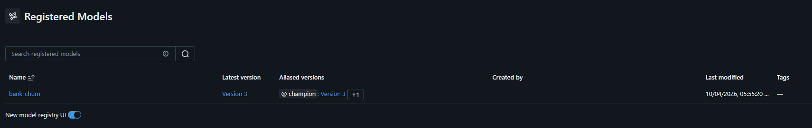
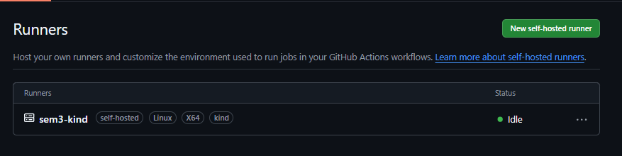
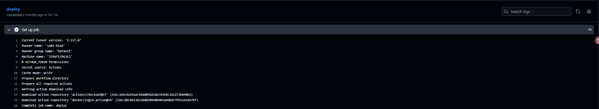
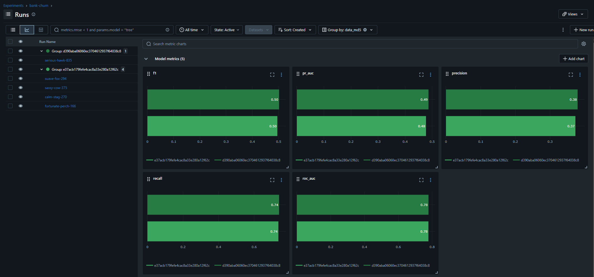
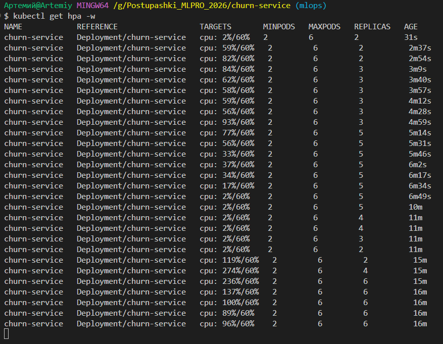

Задание 2.1

$ kubectl get pods,ingress -A
NAMESPACE            NAME                                              READY   STATUS    RESTARTS   AGE
kube-system          pod/coredns-559f6c778d-7tg4m                      1/1     Running   0          25m
kube-system          pod/coredns-559f6c778d-zfr6h                      1/1     Running   0          25m
kube-system          pod/etcd-sem3n-control-plane                      1/1     Running   0          25m
kube-system          pod/kindnet-fvgk6                                 1/1     Running   0          25m
kube-system          pod/kube-apiserver-sem3n-control-plane            1/1     Running   0          25m
kube-system          pod/kube-controller-manager-sem3n-control-plane   1/1     Running   0          25m
kube-system          pod/kube-proxy-4bg46                              1/1     Running   0          25m
kube-system          pod/kube-scheduler-sem3n-control-plane            1/1     Running   0          25m
local-path-storage   pod/local-path-provisioner-75f7fc7dc5-hwmmh       1/1     Running   0          25m
mlops                pod/mlflow-9f98c4469-n6zrz                        1/1     Running   0          12m
traefik              pod/traefik-6d88bc478f-qh2ld                      1/1     Running   0          42s

NAMESPACE   NAME                                      CLASS     HOSTS               ADDRESS   PORTS   AGE
default     ingress.networking.k8s.io/churn-service   traefik   churn.localhost               80      6m16s
mlops       ingress.networking.k8s.io/airflow         traefik   airflow.localhost             80      6m16s
mlops       ingress.networking.k8s.io/mlflow          traefik   mlflow.localhost              80      6m16s

Задание 2.2

1 запуск
🧪 View experiment at: http://mlflow.localhost/#/experiments/1
{"run_id": "a558e75b911948c1a3cb797aef51d165", "version": "1", "C": 0.0003, "pr_auc": 0.4701, "data_md5": "e37acb17", "champion_before": null, "champion_pr_auc_before": null, "min_gain": 0.01, "promoted": true}

2 запуск 
🧪 View experiment at: http://mlflow.localhost/#/experiments/1
{"run_id": "6893118ceb6c4419948f5e13ef6ca8d8", "version": "2", "C": 0.0001, "pr_auc": 0.4661, "data_md5": "e37acb17", "champion_before": "1", "champion_pr_auc_before": 0.4701, "min_gain": 0.01, "promoted": false}

3 запуск 
🧪 View experiment at: http://mlflow.localhost/#/experiments/1
{"run_id": "9c7ce7add5bd4f909fa469f0a040b84e", "version": "3", "C": 1.0, "pr_auc": 0.4865, "data_md5": "e37acb17", "champion_before": "1", "champion_pr_auc_before": 0.4701, "min_gain": 0.01, "promoted": true}

Задание 2.3

$ curl -s http://churn.localhost/health
{"status":"ok","model_version":"bank-churn/3","model_source":"registry: bank-churn@champion","log_level":"INFO"}(churn-service) 

$ curl http://churn.localhost/health
{"status":"ok","model_version":"bank-churn/2","model_source":"registry: bank-churn@champion","log_level":"INFO"}(churn-service) 

16 секунд прошло

Задание 2.4

Ссылка на зеленый прогон:
https://github.com/overcast17/churn-service/actions/runs/37218649782/job/111484468363

Скрин Runners:

Скрин из deploy, где видно runner: 

Задание 2.5 

dvc push:
Collecting                                              |1.00 [00:00,  312entry/s]
Pushing
Everything is up to date.
(churn-service) 

dvc pull:
Collecting                                              |1.00 [00:00,  323entry/s]
Fetching
Building workspace index                                |1.00 [00:00, 73.5entry/s]
Comparing indexes                                      |3.00 [00:00, 1.15kentry/s]
Applying changes                                        |1.00 [00:00,  74.1file/s]
A       data\Customer-Churn-Records.csv
1 file fetched and 1 file added

Задание 2.6

Задание 2.7 

Вопросы: 
1. Почему tests и build по‐прежнему идут в облаке GitHub, а deploy не может? Какие ещё есть способы доставить код в кластер за NAT и почему мы выбрали runner?

Test и Build нужен только код, а он доступен в GitHub, а вот Deploy нужно подлючиться к нашему локальному кластеру. Был выбрин Runner потому что он работает непосредтсвенно внутри нашего кластера. Также можно дотавить код с помощью тунеля до моей сети и уже через него отправляются команды в кластер

2. Зачем runner запущен с ‐‐network kind, сокетом Docker и ‐‐group‐add 0? Что ломается безкаждого из трёх?

1) ‐‐network kind, чтобы находился в одной сети с нодой кластера. 
2)сокетом Docker, чтобы раннер мог управлять докером.
3)‐‐group‐add 0, чтобы у раннера были права на чтение и запись в сокет. 

3. Почему create secret заменили на ‐‐dry‐run=client ‐o yaml | kubectl apply? Что будет при втором деплое без этой замены?

При создании уже существующего секрета в кластере, происходит ошибка и деплой не пройдет. При втором деплое будет ошибка. 

4. Чем challenger отличается от champion? Почему сервис просит алиас, а не номер версии?Сравните откат модели через алиас с откатом кода через rollout undo.

Champion - версия моедли, которая сейчас работает в проде. Challenger - более новая версия модели, которая еще ждет проверки, чтобы стать основной. Потому что по сути своей номер версии это ссылка на прогон той или иной модели и их может быть сотни,а allias это подвижная метка модели, которая присваивается определненой модели.Откат через alias это про переставить alias и перезапустить поды, а через rollout undo это по сути новый образ и новые CI/CD то есть полный цикл выката модели проходим заново.  

5. Что будет, если задеплоить сервис в кластер, где никто ещё не обучил модель? Как это увидеть в k9s и в логе CI?

6. Проследите запрос от браузера до пода MLflow: какие порты и какие компоненты он про‐
ходит? Зачем MLflow нужны ‐‐allowed‐hosts и ‐‐cors‐allowed‐origins, и почему порт 80 за‐даётся при создании кластера, а не потом?

Браузер -> Ingress ml.local -> MlFlow:5000 

7. Посчитайте по формуле из лекции 3.1, сколько реплик HPA должен был выставить при ва‐
шей загрузке CPU, и сравните с тем, что он выставил. Почему вниз реплики уходили дольше,чем вверх?

8. Что лежит в git, а что в хранилище DVC? По шагам: как восстановить ровно те данные, на которых обучена версия N вашей модели в реестре?
