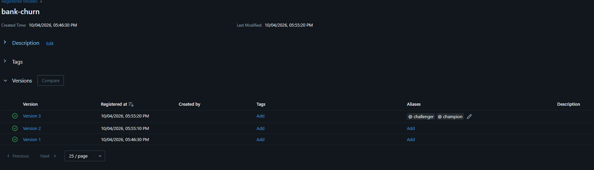

# Отчёт: модель из реестра в своём кластере

Домашнее задание 3, ML PRO. MLflow и Traefik в kind, модель в реестре с гейтом, сервис по алиасу,
деплой из GitHub Actions через self-hosted runner, данные под DVC, автомасштабирование HPA.

## Чекпоинты

| Пункт | Ссылка или скрин |
|---|---|
| 2.1 Кластер, MLflow, Ingress | вывод `kubectl get pods,ingress -A` ниже |
| 2.2 Три запуска с гейтом | [скрин реестра](../images/mlflow_registry_v2.png), вывод запусков ниже |
| 2.3 Откат модели | `/health` до и после ниже, 16 с |
| 2.4 Зелёный deploy на своём runner | [run 37218649782](https://github.com/overcast17/churn-service/actions/runs/37218649782), [скрин runners](../images/runners.png), [Runner name в логе](../images/deploy_runner.png) |
| 2.5 DVC | [data/Customer-Churn-Records.csv.dvc](../data/Customer-Churn-Records.csv.dvc), [скрин двух прогонов](../images/mlflow_different_md5.png) |
| 2.6 HPA | [скрин kubectl get hpa -w](../images/get_hpa.png), таблица ниже |
| 2.7 Модели нет в реестре | [красный](https://github.com/overcast17/churn-service/actions/runs/37225638275) → [зелёный](https://github.com/overcast17/churn-service/actions/runs/37226383851) |
| 2.7 Runner не видит кластер | [красный](https://github.com/overcast17/churn-service/actions/runs/37227128667) → [зелёный](https://github.com/overcast17/churn-service/actions/runs/37227573849) |
| 2.7 Ingress мимо | [красный](https://github.com/overcast17/churn-service/actions/runs/37227956265) → [зелёный](https://github.com/overcast17/churn-service/actions/runs/37228296807) |
| ⭐ Деплой по кнопке | [push: build прошёл, deploy ждёт](https://github.com/overcast17/churn-service/actions/runs/37217790309) → [после кнопки](https://github.com/overcast17/churn-service/actions/runs/37218649782) |

### Задание 2.1

```
$ kubectl get pods,ingress -A
NAMESPACE            NAME                                              READY   STATUS    RESTARTS   AGE
kube-system          pod/coredns-559f6c778d-7tg4m                      1/1     Running   0          25m
kube-system          pod/coredns-559f6c778d-zfr6h                      1/1     Running   0          25m
kube-system          pod/etcd-sem3n-control-plane                      1/1     Running   0          25m
kube-system          pod/kindnet-fvgk6                                 1/1     Running   0          25m
kube-system          pod/kube-apiserver-sem3n-control-plane            1/1     Running   0          25m
kube-system          pod/kube-controller-manager-sem3n-control-plane   1/1     Running   0          25m
kube-system          pod/kube-proxy-4bg46                              1/1     Running   0          25m
kube-system          pod/kube-scheduler-sem3n-control-plane            1/1     Running   0          25m
local-path-storage   pod/local-path-provisioner-75f7fc7dc5-hwmmh       1/1     Running   0          25m
mlops                pod/mlflow-9f98c4469-n6zrz                        1/1     Running   0          12m
traefik              pod/traefik-6d88bc478f-qh2ld                      1/1     Running   0          42s

NAMESPACE   NAME                                      CLASS     HOSTS               ADDRESS   PORTS   AGE
default     ingress.networking.k8s.io/churn-service   traefik   churn.localhost               80      6m16s
mlops       ingress.networking.k8s.io/airflow         traefik   airflow.localhost             80      6m16s
mlops       ingress.networking.k8s.io/mlflow          traefik   mlflow.localhost              80      6m16s
```

### Задание 2.2



1 запуск
```
🧪 View experiment at: http://mlflow.localhost/#/experiments/1
{"run_id": "a558e75b911948c1a3cb797aef51d165", "version": "1", "C": 0.0003, "pr_auc": 0.4701, "data_md5": "e37acb17", "champion_before": null, "champion_pr_auc_before": null, "min_gain": 0.01, "promoted": true}
```

2 запуск 
```
🧪 View experiment at: http://mlflow.localhost/#/experiments/1
{"run_id": "6893118ceb6c4419948f5e13ef6ca8d8", "version": "2", "C": 0.0001, "pr_auc": 0.4661, "data_md5": "e37acb17", "champion_before": "1", "champion_pr_auc_before": 0.4701, "min_gain": 0.01, "promoted": false}
```

3 запуск 
```
🧪 View experiment at: http://mlflow.localhost/#/experiments/1
{"run_id": "9c7ce7add5bd4f909fa469f0a040b84e", "version": "3", "C": 1.0, "pr_auc": 0.4865, "data_md5": "e37acb17", "champion_before": "1", "champion_pr_auc_before": 0.4701, "min_gain": 0.01, "promoted": true}
```

**Метрика гейта и MIN_GAIN.** Ушедших клиентов всего 20%, поэтому гейт смотрит на PR-AUC, а не на ROC-AUC:
ROC-AUC на дисбалансе завышен за счёт множества лёгких «оставшихся» клиентов, а PR-AUC показывает, насколько
хорошо модель находит именно уходящих. По ROC-AUC мои версии вообще не различаются (0.7768–0.7805, всё в шуме).
`MIN_GAIN = 0.01`: разницу PR-AUC двух логрегрессий на одном и том же тесте я прогнал бутстрепом, её разброс
σ ≈ 0.002–0.005, значит 0.01 это не меньше 2σ. Прирост меньше — шум сплита, ради него модель в проде не меняем
(например, `C=1` против `C=0.01` дают разницу 0.001).

**Свой артефакт** — `pr_curve.png` в каждом прогоне: PR-кривая на тесте, красной точкой рабочий порог,
пунктиром доля оттока. **Порог** выбирается на OOF-предсказаниях train, как в ноутбуке, а не на тесте.

### Задание 2.3

До отката:
```
$ curl -s http://churn.localhost/health
{"status":"ok","model_version":"bank-churn/3","model_source":"registry: bank-churn@champion","log_level":"INFO"}
```

После отката (champion перевешен на v2 в UI, `kubectl rollout restart`):
```
$ curl http://churn.localhost/health
{"status":"ok","model_version":"bank-churn/2","model_source":"registry: bank-churn@champion","log_level":"INFO"}
```

16 секунд прошло

Сервис на старте спрашивает реестр, какая версия под `@champion`, и грузит модель и `metadata.json` по номеру
этой версии. Без `MODEL_NAME` грузится `artifact/model.joblib`, на этом идут тесты в CI.

### Задание 2.4

Ссылка на зеленый прогон:
https://github.com/overcast17/churn-service/actions/runs/37218649782/job/111484468363

Скрин Runners:


Скрин из deploy, где видно runner: 


**Smoke** идёт через Ingress (`http://sem3n-control-plane:30080` с заголовком `Host: churn.localhost`) и проверяет три вещи:
1. `/health`: `model_source` начинается с `registry:` — модель пришла из реестра;
2. на моих признаках: клиент 60 лет из Германии, неактивный → `churn: true` (0.778), клиент 30 лет с двумя продуктами,
   активный → `churn: false` (0.059), и score первого больше второго;
3. в `predictions` ровно одна строка с `request_id` из ответа.

### Задание 2.5 

dvc push:
```
Collecting                                              |1.00 [00:00,  312entry/s]
Pushing
Everything is up to date.
(churn-service) 
```


dvc diff (v1 → v2):
```
$ uv run dvc diff 3b76c3f 9381627
Modified:
    data\Customer-Churn-Records.csv

files summary: 1 modified
```

dvc pull:
```
Collecting                                              |1.00 [00:00,  323entry/s]
Fetching
Building workspace index                                |1.00 [00:00, 73.5entry/s]
Comparing indexes                                      |3.00 [00:00, 1.15kentry/s]
Applying changes                                        |1.00 [00:00,  74.1file/s]
A       data\Customer-Churn-Records.csv
1 file fetched and 1 file added
```

`md5sum` в чистом клоне — `d390aba06060ec3704612937f64038c8`, совпадает с md5 в `.dvc` и с `data_md5` прогона на v2.

**Вторая версия данных** — убран столбец `Complain`: он совпадает с `Exited` почти во всех строках, это утечка
таргета. Пропусков и дублей в датасете нет, чистить было нечего. Признаки модели не поменялись, поэтому PR-AUC
двух прогонов одинаковый (0.4865), а `data_md5` разный: `e37acb17…` (v1) и `d390aba0…` (v2).

### Задание 2.6


| Пользователи | Реплики | p95, мс | CPU на под: пик → установившийся |
|---|---|---|---|
| 20 | 2 → 5 | 13 | 93m → ~60m |
| 40 | 2 → 6 | 15 | 171m → ~60m |
| 60 | 2 → 6 | 17 | 274m → ~90m |

CPU в процентах от `requests.cpu: 100m` из `kubectl get hpa -w`. Пик — пока подов ещё 2, установившийся — когда
HPA их добавил. Прогоны шли в порядке 20 → 60 → 40, `-r 20 -t 4m`, через Ingress.

```
$ kubectl describe hpa churn-service
...
Events:
  Type    Reason             Age                  From                       Message
  ----    ------             ----                 ----                       -------
  Normal  SuccessfulRescale  39m                  horizontal-pod-autoscaler  New size: 5; reason: cpu resource utilization (percentage of request) above target
  Normal  SuccessfulRescale  33m                  horizontal-pod-autoscaler  New size: 3; reason: All metrics below target
  Normal  SuccessfulRescale  29m                  horizontal-pod-autoscaler  New size: 4; reason: cpu resource utilization (percentage of request) above target
  Normal  SuccessfulRescale  13m (x2 over 42m)    horizontal-pod-autoscaler  New size: 3; reason: cpu resource utilization (percentage of request) above target
  Normal  SuccessfulRescale  12m (x2 over 29m)    horizontal-pod-autoscaler  New size: 6; reason: cpu resource utilization (percentage of request) above target
  Normal  SuccessfulRescale  4m31s (x3 over 34m)  horizontal-pod-autoscaler  New size: 4; reason: All metrics below target
  Normal  SuccessfulRescale  4m15s (x3 over 33m)  horizontal-pod-autoscaler  New size: 2; reason: All metrics below target
```

**requests.** До: `cpu: 100m`, `memory: 256Mi`. Под нагрузкой под занимает 181–182Mi (`kubectl top pods`),
плюс треть ≈ 240Mi — текущий запрос почти совпадает, поэтому оставил `256Mi`. Даже 20 пользователей поднимают
5 реплик: 60% от `100m` это всего 60m CPU на под.

### Задание 2.7 

| Поломка | Job / шаг | Что в логе |
|---|---|---|
| `MODEL_ALIAS: prod` | deploy / сервис | `1 out of 2 new replicas have been updated` → `timed out`, под `CrashLoopBackOff`, `Registered model alias prod not found` |
| `KIND_CLUSTER: tuntuntun` | deploy / kind, kubectl и доступ к кластеру | `could not locate any control plane nodes for cluster named 'tuntuntun'` |
| smoke `Host: churn2.localhost` | deploy / smoke | `exit code 22` на первом `curl /health` |

**Модели нет в реестре.** Упал шаг «сервис»: `rollout status` застрял на `1 out of 2 new replicas` и вышел по таймауту.
В диагностике новый под в `CrashLoopBackOff`, в его логе `RestException: Registered model alias prod not found` и
`Application startup failed` — сервис на старте спрашивает реестр по алиасу из ConfigMap, а такого алиаса нет.
Старые поды остались `Running`, сервис не падал.

**Runner не видит кластер.** Упал первый же шаг с кластером: `kind export kubeconfig` пишет, что не нашёл control plane
у кластера с таким именем. Значит, имя кластера в `KIND_CLUSTER` неверное — до образа и манифестов дело не дошло.

**Ingress мимо.** Ingress сервиса у меня лежит в `platform/ingress.yaml`, как на семинаре, и CI его не применяет,
поэтому несовпадение сделал со стороны smoke: он стучится с `Host: churn2.localhost`, а Ingress ждёт `churn.localhost`.
Упал шаг «smoke» с `exit code 22` — у curl это «HTTP-ответ ≥ 400», Traefik на неизвестный host отдаёт 404. Всё
до smoke зелёное, в диагностике `kubectl get ingress -A` показывает `churn.localhost` — видно, что адрес не совпал.

## Вопросы: 

1. Почему tests и build по‐прежнему идут в облаке GitHub, а deploy не может? Какие ещё есть способы доставить код в кластер за NAT и почему мы выбрали runner?

Test и Build нужен только код, а он доступен в GitHub, а вот Deploy нужно подлючиться к нашему локальному кластеру. Был выбрин Runner потому что он работает непосредтсвенно внутри нашего кластера. Также можно дотавить код с помощью тунеля до моей сети и уже через него отправляются команды в кластер


2. Зачем runner запущен с ‐‐network kind, сокетом Docker и ‐‐group‐add 0? Что ломается безкаждого из трёх?

* ‐‐network kind, чтобы находился в одной сети с нодой кластера. 
* сокетом Docker, чтобы раннер мог управлять докером.
* ‐‐group‐add 0, чтобы у раннера были права на чтение и запись в сокет. 


3. Почему create secret заменили на ‐‐dry‐run=client ‐o yaml | kubectl apply? Что будет при втором деплое без этой замены?

При создании уже существующего секрета в кластере, происходит ошибка и деплой не пройдет. При втором деплое будет ошибка. 


4. Чем challenger отличается от champion? Почему сервис просит алиас, а не номер версии?Сравните откат модели через алиас с откатом кода через rollout undo.

Champion - версия моедли, которая сейчас работает в проде. Challenger - более новая версия модели, которая еще ждет проверки, чтобы стать основной. Потому что по сути своей номер версии это ссылка на прогон той или иной модели и их может быть сотни,а allias это подвижная метка модели, которая присваивается определненой модели.Откат через alias это про переставить alias и перезапустить поды, а через rollout undo это по сути новый образ и новые CI/CD то есть полный цикл выката модели проходим заново.  


5. Что будет, если задеплоить сервис в кластер, где никто ещё не обучил модель? Как это увидеть в k9s и в логе CI?

Сервис упадет без модели, потому что он спрашивает у реестра alias, а там его нет. В k9s под красный и количество Restarts растет. В CI падает "сервис" по таймауту и появляется ошибка "CrashLoopBackOff"


6. Проследите запрос от браузера до пода MLflow: какие порты и какие компоненты он про‐
ходит? Зачем MLflow нужны ‐‐allowed‐hosts и ‐‐cors‐allowed‐origins, и почему порт 80 за‐даётся при создании кластера, а не потом?

Браузер -> Ingress ml.local -> MlFlow:5000 

Подробнее, с портами:
1. Браузер → `http://mlflow.localhost:80`. Имя `*.localhost` браузер сам отправляет на `127.0.0.1`.
2. `127.0.0.1:80` на моей машине → kind пробрасывает его в контейнер ноды на порт `30080` (`extraPortMappings` в `kind-config.yaml`).
3. `30080` на ноде — это NodePort сервиса Traefik (порт сервиса 80) → под Traefik, порт `8000`.
4. Traefik смотрит на заголовок `Host: mlflow.localhost`, находит Ingress `mlflow` и отправляет запрос в Service `mlflow:5000` в namespace `mlops`.
5. Service → под MLflow, порт `5000`.

`--allowed-hosts` — защита MLflow от подмены имени хоста: он отвечает только на те имена, что в списке, на остальные отдаёт 403.
Поэтому там и `mlflow.localhost` (браузер через Ingress), и `mlflow.mlops` (сервис изнутри кластера), и `localhost` (port-forward).
`--cors-allowed-origins` нужен самому UI: страница с `http://mlflow.localhost` делает запросы к API, и без этого флага
MLflow блокирует их как чужие (`Blocked cross-origin`, в UI `Failed to load`).

Порт 80 задаётся при создании кластера, потому что нода kind — это Docker-контейнер, а порты контейнеру Docker
пробрасывает только при его создании. Добавить их потом нельзя, только пересоздать кластер — поэтому я и пересоздавал
кластер с `kind-config.yaml`, старый кластер со 2-й домашки был без этого проброса.


7. Посчитайте по формуле из лекции 3.1, сколько реплик HPA должен был выставить при ва‐
шей загрузке CPU, и сравните с тем, что он выставил. Почему вниз реплики уходили дольше,чем вверх?

Формула: `нужно реплик = ceil(сейчас реплик × текущий CPU% / 60%)`.
- 20 пользователей: 2 пода при 84% → ceil(2 × 84 / 60) = ceil(2.8) = 3, HPA поставил 3; потом 3 пода при 93% → ceil(4.65) = 5, поставил 5.
- 60 пользователей: 2 пода при 119% → ceil(3.97) = 4, поставил 4; потом при 236% → 16, но упёрся в `maxReplicas: 6`.
- 40 пользователей: 2 пода при 79% → ceil(2.63) = 3, поставил 3; потом при 171% → 9, ограничено 6.

Вниз дольше, потому что у HPA окно стабилизации на уменьшение 5 минут.

8. Что лежит в git, а что в хранилище DVC? По шагам: как восстановить ровно те данные, на которых обучена версия N вашей модели в реестре?

В git лежит файл в формате csv.dvc который супер легкий, а в хранилище DVC непосредвенно сам файл .csv. 
Чтобы восстановить данные, нужно узнать md5 значение того датасета, на котором была обучена модель и с помощью команды dvc pull по данному хешу мы сможем получить ихсодные данные на которых и обучалась выбранная модель.


## Журнал проблем

(что не завелось с первого раза: текст ошибки → как починили)

### Кластер и MLflow
1. `train.py` висел без вывода. → Python на Windows не резолвит `mlflow.localhost` (`getaddrinfo failed`), браузер и curl делают это сами, а клиент MLflow молча ретраит. Дописал `127.0.0.1 mlflow.localhost churn.localhost` в `hosts`.
2. `docker run` runner'а из Git Bash → `mkdir C:\Program Files\Git\var: Access is denied`. Git Bash переписал путь к сокету. → `MSYS_NO_PATHCONV=1` перед командой. Плюс опечатка `--url $ REPO_URL` с пробелом.

### CI
1. Smoke упал на `grep -q '"model_version":"churn-v'` ([попытка 3](https://github.com/overcast17/churn-service/actions/runs/37216584401/attempts/3)) → проверка осталась с семинара, у меня версия `bank-churn/3`, и файла `good.json` нет. → Проверка `model_source` = `registry:`, `valid.json`.
2. Smoke упал с `exit code 4`, пустой `risky_pred.json` ([run 37218048014](https://github.com/overcast17/churn-service/actions/runs/37218048014)) → сразу после выката Traefik ещё отправил запрос на убитый под (502), `curl --fail` без повторов молча отдал пустой ответ. То же было руками в 2.3: первый `curl` после `rollout status` — `Bad Gateway`. → `sleep 5` перед запросами.

### HPA

Общая проблема — медленные `dl.k8s.io` и `registry.k8s.io`, и то, что Windows и Git Bash по-своему обходятся с путями и именами.
